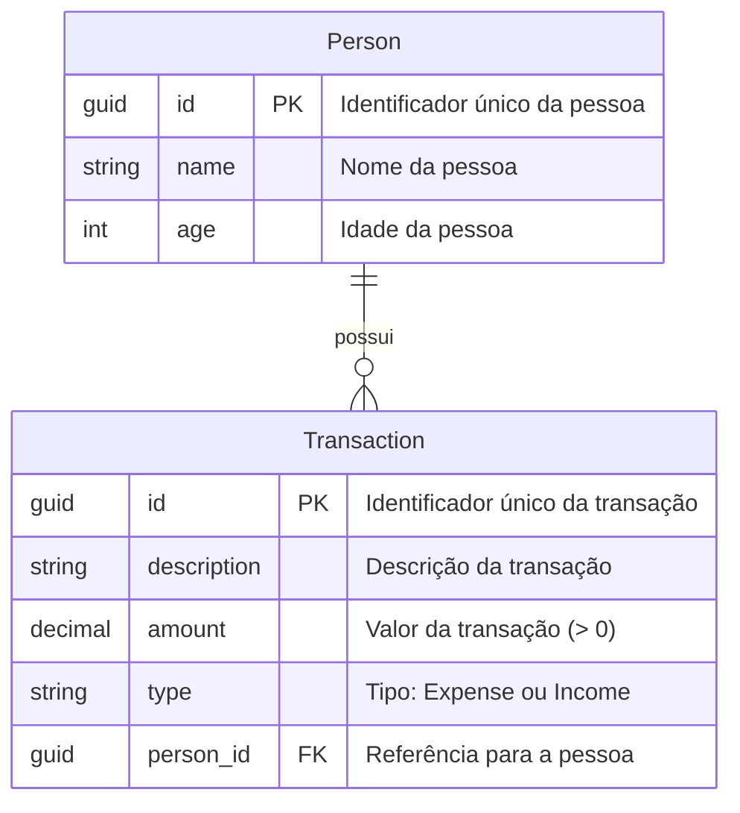

# Controle de Gastos Residenciais

API RESTful para controle de gastos residenciais, construída com **.NET 8**, **ASP.NET Core Web API**, **Entity Framework Core** e banco de dados **SQLite**. Inclui front-end em **React + TypeScript** e testes unitários.

## ✨ Funcionalidades

- **API RESTful** para cadastro de pessoas, transações e consulta de totais
- Banco de dados **SQLite em arquivo** (persistência real em disco, sem servidor externo)
- **Testes unitários** com xUnit e Entity Framework InMemory
- Validação de regras de negócio no servidor, incluindo a regra de menores de idade
- Tratamento centralizado de exceções via middleware
- Front-end em **React + TypeScript**, com interface em português e layout responsivo

## 📋 Pré-requisitos

- [.NET SDK 8](https://dotnet.microsoft.com/download) ou superior
- [Node.js 18](https://nodejs.org/) ou superior
- (Opcional) IDE compatível com .NET e React (VS Code, Visual Studio, Rider)

## 🚀 Instalação e Execução

### 1. Clonar repositório

```bash
git clone <url-do-repositorio>
cd household-expense-tracker
```

### 2. Executar o back-end (API)

```bash
cd backend/HouseholdExpenseTracker.Api
dotnet run
```

A API estará disponível em:
http://localhost:5168

O banco de dados SQLite (`householdexpensetracker.db`) é criado automaticamente na primeira execução, com as migrations já aplicadas.

### 3. Executar o front-end

Em outro terminal:

```bash
cd frontend
npm install
npm run dev
```

A aplicação estará disponível em:
http://localhost:5173

Se a porta do back-end for diferente de `5168`, ajuste `frontend/.env`:
```
VITE_API_URL=http://localhost:PORTA/api
```

## 🔍 Testando a Aplicação

A API pode ser testada das seguintes formas:

- **Interface web**: através do front-end em http://localhost:5173
- **Insomnia ou Postman**: envie requisições diretamente para os endpoints

**Executar todos os testes unitários:**

```bash
cd backend/HouseholdExpenseTracker.Api.Tests
dotnet test
```

## 📚 Documentação da API

### Principais Endpoints

**Pessoas**

- `POST /api/people` — Cadastra uma pessoa
- `GET /api/people` — Lista todas as pessoas
- `DELETE /api/people/{id}` — Exclui uma pessoa (e suas transações, em cascata)

**Transações**

- `POST /api/transactions` — Cadastra uma transação
- `GET /api/transactions` — Lista todas as transações

**Totais**

- `GET /api/totals` — Retorna totais de receita, despesa e saldo por pessoa e consolidado

### Exemplos de entrada e saída

#### `POST /api/people`

Entrada:
```json
{
  "name": "João Silva",
  "age": 15
}
```

Saída:
```json
{
  "id": "b1a7c2e0-1234-4a8b-9c3d-5e6f7a8b9c0d",
  "name": "João Silva",
  "age": 15
}
```

---

#### `POST /api/transactions`

**regra:** menores de 18 anos só podem cadastrar despesas (`type: "Expense"`). O `personId` precisa referenciar uma pessoa existente e o `amount` deve ser maior que zero.

Entrada:
```json
{
  "description": "Mesada",
  "amount": 50.00,
  "type": "Expense",
  "personId": "b1a7c2e0-1234-4a8b-9c3d-5e6f7a8b9c0d"
}
```

Saída:
```json
{
  "id": "9f3c1d2e-5678-4a1b-8c2d-3e4f5a6b7c8d",
  "description": "Mesada",
  "amount": 50.00,
  "type": "Expense",
  "personId": "b1a7c2e0-1234-4a8b-9c3d-5e6f7a8b9c0d",
  "personName": "João Silva"
}
```

---

#### `GET /api/people`

Saída:
```json
[
  { "id": "b1a7c2e0-1234-4a8b-9c3d-5e6f7a8b9c0d", "name": "João Silva", "age": 15 },
  { "id": "1f79be9b-94aa-4cf8-bf4f-bb9b0dcb7179", "name": "Maria Adulta", "age": 30 }
]
```

---

#### `GET /api/transactions`

Saída:
```json
[
  {
    "id": "9f3c1d2e-5678-4a1b-8c2d-3e4f5a6b7c8d",
    "description": "Mesada",
    "amount": 50.00,
    "type": "Expense",
    "personId": "b1a7c2e0-1234-4a8b-9c3d-5e6f7a8b9c0d",
    "personName": "João Silva"
  }
]
```

---

#### `GET /api/totals`

Saída:
```json
{
  "byPerson": [
    {
      "personId": "b1a7c2e0-1234-4a8b-9c3d-5e6f7a8b9c0d",
      "personName": "João Silva",
      "totalIncome": 0,
      "totalExpense": 50.00,
      "balance": -50.00
    }
  ],
  "totalIncome": 0,
  "totalExpense": 50.00,
  "balance": -50.00
}
```

---

#### `DELETE /api/people/{id}`

Exclui a pessoa e, em cascata, todas as suas transações associadas. Retorna `204 No Content`.

## 🛠️ Configuração do Banco de Dados

O projeto utiliza **SQLite em arquivo**, sem necessidade de configuração externa:

```json
// appsettings.json
"ConnectionStrings": {
  "DefaultConnection": "Data Source=householdexpensetracker.db"
}
```

O arquivo `householdexpensetracker.db` é criado automaticamente em `backend/HouseholdExpenseTracker.Api/` na primeira execução (`dotnet run`), através de migrations aplicadas no startup (`Program.cs`). Os dados persistem entre reinícios da aplicação.

## 🧱 Modelo de Dados



**Regra de negócio principal:** pessoas menores de 18 anos só podem ter transações do tipo despesa. A validação ocorre no servidor (`TransactionService`), garantindo a integridade da regra independentemente da origem da requisição.

## ⚠️ Tratamento de Erros

Erros de regra de negócio são convertidos em respostas HTTP padronizadas por um middleware central (`ErrorHandlingMiddleware`):

| Situação | Status | Corpo da resposta |
|---|---|---|
| Regra de negócio violada (menor com receita, valor inválido, etc.) | 400 | `{ "message": "..." }` |
| Pessoa não encontrada | 404 | `{ "message": "..." }` |

## 📁 Estrutura do Repositório

```
household-expense-tracker/
├── backend/
│   ├── HouseholdExpenseTracker.Api/
│   │   ├── Controllers/         # PeopleController, TransactionsController, TotalsController
│   │   ├── Services/            # PersonService, TransactionService, TotalsService
│   │   ├── Services/Exceptions/ # Exceções de domínio
│   │   ├── Models/              # Person, Transaction, TransactionType
│   │   ├── Dtos/                # Contratos de entrada/saída da API
│   │   ├── Data/                # AppDbContext (EF Core)
│   │   ├── Middleware/          # Tratamento centralizado de erros
│   │   └── Migrations/          # Migrations do EF Core (SQLite)
│   └── HouseholdExpenseTracker.Api.Tests/
│       └── *.cs                 # Testes unitários (xUnit + EF InMemory)
└── frontend/
    └── src/
        ├── api/          # Cliente HTTP para a API
        ├── components/   # PersonManager, TransactionManager, TotalsView
        └── types/        # Tipos TypeScript espelhando os DTOs da API
```

---

**Mais detalhes**: consulte o histórico de commits do repositório para acompanhar a evolução incremental do projeto (setup, models, regras de negócio, front-end, estilização e testes).